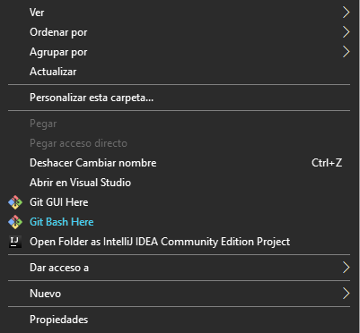
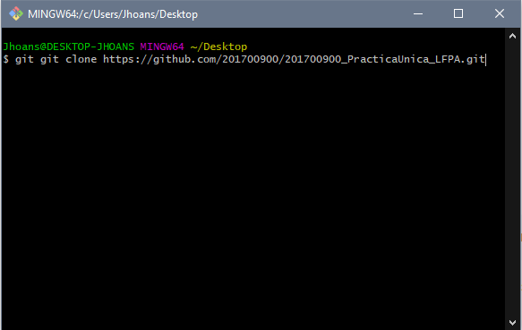
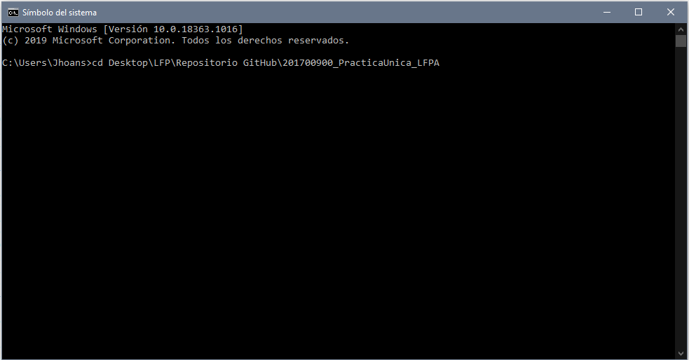
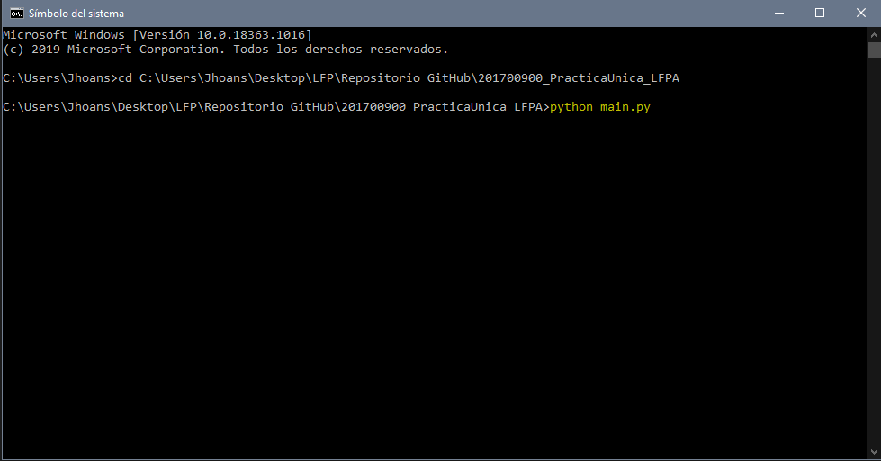
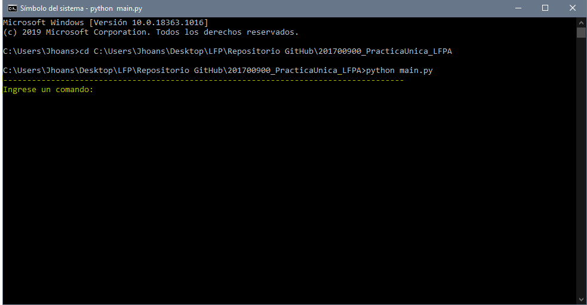

# SIMPLEQL CLI - MANUAL DE USUARIO

SimpleQL es un lenguaje de consultas que funciona únicamente a nivel de consola, su
propósito es facilitar al usuario la búsqueda de registros completos en archivos json, en los
que buscar registro por registro podría ser muy tedioso y cansado

### ARCHIVOS DEL PROYECTO

- `README.md` con manual de usuario, instrucciones de instalación, uso y
  documentación del API.
- `registro.json`: Archivo JSON para hacer pruebas de carga 
- `main.py`, script principal que se ejecuta para para probar el programa
- `reporte.html` HTML que contiene el reporte
- `.gitignore` para ignorar `node_modules` u otras carpetas que no deban
  incluirse en control de versiones (`git`).

## COMANDOS

### 1. CARGAR
Este comando sirve para cargar los registros en los archivos.JSON que se encuentren en la misma carpeta del equipo.
* Se ejecuta escribiendo:
```
CARGAR archivo1.json, archivo2.json
```
* Se podrán cargar N archivos separados por comas, mientras estos existan en la carpeta del archivo.
*  Al ejecutar este comando se cargarán los archivos y se devolverá un mensaje de éxito.
### 2. SELECCIONAR
Comando que nos muestra los registros que seleccionemos `DONDE` se cumpla la condición
* Hay tres formas de usarlo:
```
SELECCIONAR nombre, edad, promedio, activo DONDE nombre = “Francisco”
SELECCIONAR *
SELECCIONAR nombre, edad DONDE promedio = 14.45
``` 
* Para los nombres debemos escribir comillas `nombre = “Francisco”`
* Con asterisco `SELECCIONAR *` nos muestra todos los registros cargados
* Con `SELECCIONAR * DONDE edad = 25` nos muestra todos los atributos de los registros que cumplan la condición
### 3. MAXIMO
Nos muestra el maximo registro de `edad` o de `promedio`
* Se ejecuta con:
```
MAXIMO edad
MAXIMO promedio
```
### 4. MINIMO 
Permite encontrar el valor mínimo que se encuentre en `edad` o `promedio`
* Se ejecuta con:
```
MINIMO edad
MINIMO promedio
```
### 5. SUMA
Permite obtener la suma de todos los valores de un atributo especificado en el
comando.
* Estructura:
```
SUMA edad
SUMA promedio
```
### 6. CUENTA
Permite contar el número de registros que se han cargado a memoria.
* Estructura:

```
CUENTA
```
### 7. REPORTAR
Este comando permite crear un reporte en html que contiene N cantidad de
registros.
* Estructura:
```
REPORTAR N
```
### 8. SALIR
Termina la ejecución del programa.
* Se utiliza escribiendo 
```
SALIR
```

## CLONAR
Para poder ejecutar el programa se tiene que clonar o simplemente descargar los archivos.

* Para clonar, rimero se ejecuta el git bash en la carpeta donde se desea descargar el proyecto


* Luego escribies el comando 
```
git clone https://github.com/201700900/201700900_PracticaUnica_LFPA.git
```

* Y eso es todo, ya puedes probar el programa ejecutandolo o ver los scripts.


## Librerias requeridas

* [tabulate](https://pypi.org/project/tabulate/) 
* [pandas](https://pandas.pydata.org/docs/index.html)
* [webbrowser](https://rometools.github.io/rome/)


## CÓMO USAR
El programa consta de 7 comandos muy faciles de usar.
  Pero antes de se debe ejecutar el el programa deberá clonar o descargar los archivos del proyecto.
*  Para clonar primero se abre el Simbolo del Sistema, CMD.
* Se va a la carpeta del programa `201700900_PracticaUnica_LFPA`
  cambiando de directorio 
  con el comando `cd <path>201700900_PracticaUnica_LFPA`
   
  
* Ya en la carpeta del programa se escribe `python main.py`
    
  
* Y ya se está listo para ingresar un comando
  
